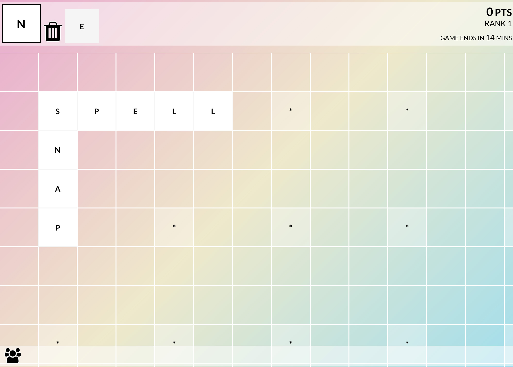

# Spell SNAP!

**An original real-time multiplayer word game, devised, designed and developed in less than 48 hours by [Jeremiah Lazarus Alexander](https://github.com/jeremiahalex) for the [2016 AngularAttack](https://www.angularattack.com) Global Hackathon.**

**[Play it Now!](https://spellsnap.2016.angularattack.io)**

### How To Play

* Place Letters on the Grid to spell out words - you get one letter at a time 
* Letters can be placed alone on an * or next to letters where they could lead to a valid word
* Complete words by placing an ! at the end - the longer the word the more points
* Trash letters you can't use for a small time penalty

### Multiplayer

* Automatically join the same game as others from across the world
* The board resets every 15 minutes, so score as many points before then as you can
* The bar at the bottom shows what letters other players currenlty have

### Build

* The frontend is AngularJS 2 written in Typescript, hosted on [Surge](https://spellsnap.2016.angularattack.io)
* The backend is a simple NodeJS server, hosted on [Heroku](https://spellsnap.herokuapp.com)
* The two communicate via Socket.io

### Support 
* There is an [emergency button](https://spellsnap.herokuapp.com) to restart the game, if there is a problem or you just can't be bothered to wait 15 minutes. 
* Anything else please contact me.
